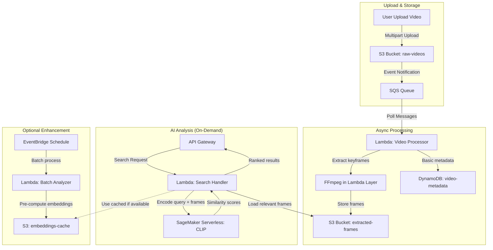

# Retrieve Video Event Details with CLIP Model using Amazon SageMaker

## Revised Pipeline Architecture

## Key Changes & Improvements

### 🔧 Architecture Fixes
1. **Replaced direct S3→Lambda with SQS**: Prevents Lambda throttling and provides better error handling
2. **Removed Rekognition dependency**: CLIP model can handle both visual and text understanding
3. **On-demand CLIP processing**: Only run expensive AI when user searches, not for every upload
4. **Simplified storage**: Use DynamoDB for basic metadata, S3 for frames and embeddings

### 💰 Cost Optimization Strategies

#### Tier 1: Essential (Minimal Cost)
- **SageMaker Serverless Inference**: Pay per request, auto-scales to zero
- **Lambda with SQS**: Decoupled processing, handle bursts efficiently
- **S3 Standard-IA**: For frames accessed less frequently
- **DynamoDB On-Demand**: Pay per request for metadata

#### Tier 2: Performance Enhancement (Optional)
- **Pre-compute embeddings**: Batch process during off-peak hours
- **S3 Intelligent Tiering**: Automatic cost optimization
- **CloudWatch Logs retention**: Set to 7 days for dev, 30 days for prod

### ⚠️ Technical Considerations & Limitations

#### CLIP Model Constraints
- **Note**: Need to verify CLIP model availability on SageMaker Marketplace
- **Alternative**: Use Hugging Face CLIP models via SageMaker JumpStart
- **Memory**: CLIP requires significant GPU memory - may need ml.g4dn.xlarge minimum

#### Lambda Limitations
- **15-minute timeout**: Large videos need chunked processing
- **10GB memory max**: May need ECS Fargate for very large videos
- **FFmpeg layer**: ~100MB, impacts cold start time

#### Scalability Notes
- **SQS visibility timeout**: Must exceed Lambda processing time
- **Concurrent executions**: Monitor Lambda limits per region
- **S3 request rates**: Consider request patterns for hot partitioning

### 📊 Estimated Monthly Costs (1000 videos/month, 5min avg)

| Service | Usage | Cost |
|---------|-------|------|
| S3 Storage | 50GB frames + videos | $1.15 |
| Lambda | 1000 executions, 5min avg | $8.33 |
| SageMaker Serverless | 100 searches/month | $2.50 |
| DynamoDB | 1000 writes, 100 reads | $0.28 |
| SQS | 1000 messages | $0.0004 |
| **Total** | | **~$12.26** |

### 🚀 Implementation Phases

#### Phase 1: MVP (Week 1-2)
- Basic video upload to S3
- Simple frame extraction with Lambda
- Manual CLIP testing with SageMaker notebook

#### Phase 2: Core Pipeline (Week 3-4)
- SQS-based async processing
- SageMaker Serverless CLIP endpoint
- Basic search API

#### Phase 3: Optimization (Week 5-6)
- Embedding caching
- Performance monitoring
- Cost optimization review

### 🔍 Missing Information to Research
- [ ] CLIP model size and memory requirements on SageMaker
- [ ] Exact pricing for SageMaker Serverless with CLIP workloads
- [ ] FFmpeg Lambda layer performance with different video formats
- [ ] Optimal frame extraction rate for different video types
- [ ] SageMaker JumpStart CLIP model variants and capabilities