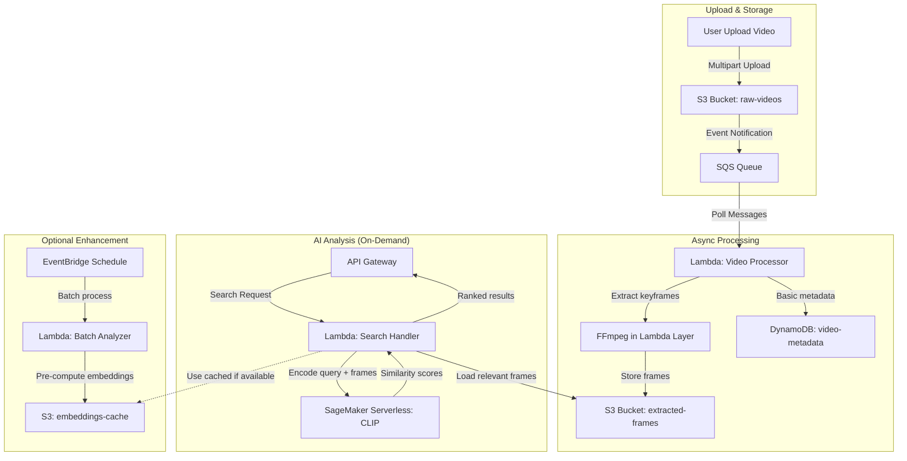
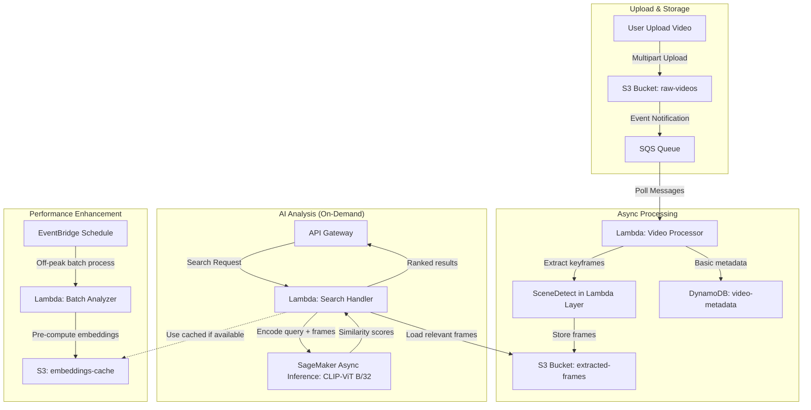

# Retrieve Video Event Details with CLIP Model using Amazon SageMaker

## Revised Pipeline Architecture

## Key Changes & Improvements

### 🔧 Architecture Fixes
1. **Replaced direct S3→Lambda with SQS**: Prevents Lambda throttling and provides better error handling
2. **Removed Rekognition dependency**: CLIP model can handle both visual and text understanding
3. **On-demand CLIP processing**: Only run expensive AI when user searches, not for every upload
4. **Simplified storage**: Use DynamoDB for basic metadata, S3 for frames and embeddings

### 💰 Cost Optimization Strategies

#### Tier 1: Essential (Minimal Cost)
- **SageMaker Serverless Inference**: Pay per request, auto-scales to zero
- **Lambda with SQS**: Decoupled processing, handle bursts efficiently
- **S3 Standard-IA**: For frames accessed less frequently
- **DynamoDB On-Demand**: Pay per request for metadata

#### Tier 2: Performance Enhancement (Optional)
- **Pre-compute embeddings**: Batch process during off-peak hours
- **S3 Intelligent Tiering**: Automatic cost optimization
- **CloudWatch Logs retention**: Set to 7 days for dev, 30 days for prod

### ⚠️ Technical Considerations & Limitations

#### CLIP Model Constraints
- **Note**: Need to verify CLIP model availability on SageMaker Marketplace
- **Alternative**: Use Hugging Face CLIP models via SageMaker JumpStart
- **Memory**: CLIP requires significant GPU memory - may need ml.g4dn.xlarge minimum

#### Lambda Limitations
- **15-minute timeout**: Large videos need chunked processing
- **10GB memory max**: May need ECS Fargate for very large videos
- **FFmpeg layer**: ~100MB, impacts cold start time

#### Scalability Notes
- **SQS visibility timeout**: Must exceed Lambda processing time
- **Concurrent executions**: Monitor Lambda limits per region
- **S3 request rates**: Consider request patterns for hot partitioning

### 📊 Estimated Monthly Costs (1000 videos/month, 5min avg)

| Service | Usage | Cost |
|---------|-------|------|
| S3 Storage | 50GB frames + videos | $1.15 |
| Lambda | 1000 executions, 5min avg | $8.33 |
| SageMaker Serverless | 100 searches/month | $2.50 |
| DynamoDB | 1000 writes, 100 reads | $0.28 |
| SQS | 1000 messages | $0.0004 |
| **Total** | | **~$12.26** |

### 🚀 Implementation Phases

#### Phase 1: MVP (Week 1-2)
- Basic video upload to S3
- Simple frame extraction with Lambda
- Manual CLIP testing with SageMaker notebook

#### Phase 2: Core Pipeline (Week 3-4)
- SQS-based async processing
- SageMaker Serverless CLIP endpoint
- Basic search API

#### Phase 3: Optimization (Week 5-6)
- Embedding caching
- Performance monitoring
- Cost optimization review

### 🔍 Missing Information to Research
- [ ] CLIP model size and memory requirements on SageMaker
- [ ] Exact pricing for SageMaker Serverless with CLIP workloads
- [ ] FFmpeg Lambda layer performance with different video formats
- [ ] Optimal frame extraction rate for different video types
- [ ] SageMaker JumpStart CLIP model variants and capabilities

<!-- v1 -->

# Retrieve Video Event Details with CLIP Model using Amazon SageMaker

## Pipeline Architecture Tối Ưu

## Các Cải Tiến Trong Pipeline

### 🔧 Cải Tiến Kiến Trúc
1. **SQS thay cho S3→Lambda trực tiếp**: Ngăn chặn Lambda throttling và xử lý lỗi tốt hơn
2. **Thay SceneDetect cho FFmpeg**: Phát hiện cảnh chính xác hơn, trích xuất khung hình có ý nghĩa
3. **SageMaker Async Inference thay vì Serverless**: Chi phí thấp hơn cho khối lượng công việc CLIP
4. **Tính toán trước embeddings**: Cải thiện hiệu suất tìm kiếm, giảm độ trễ

### 💰 Chiến Lược Tối Ưu Chi Phí

#### Cấp 1: Thiết Yếu
- **SageMaker Async Inference**: Chi phí thấp hơn Serverless khoảng 40%, phù hợp với CLIP-ViT B/32
- **Lambda với SQS**: Xử lý bất đồng bộ, hiệu quả với burst traffic
- **S3 Intelligent Tiering**: Tự động chuyển dữ liệu giữa các lớp lưu trữ
- **DynamoDB On-Demand**: Chỉ trả tiền cho yêu cầu thực tế

#### Cấp 2: Nâng Cao Hiệu Suất
- **Embeddings Cache**: Giảm 70-80% chi phí suy luận cho nội dung lặp lại
- **Reserved Instances**: Xem xét cho workload ổn định (>70% utilization)
- **CloudWatch Logs**: Giữ 7 ngày cho dev, 30 ngày cho production

### ⚠️ Xem Xét Kỹ Thuật

#### Chi Tiết Mô Hình CLIP
- **CLIP-ViT B/32 từ JumpStart**: Cân bằng tối ưu giữa hiệu suất và chi phí
  - Kích thước mô hình: ~336MB
  - Yêu cầu bộ nhớ: ~2GB
  - Độ chính xác: 0.63 Zero-shot ImageNet
- **Endpoint configuration**: ml.g4dn.xlarge hoặc ml.inf1.xlarge (tối ưu cho inference)

#### Giải Pháp SceneDetect
- **Ưu điểm**: Trích xuất khung hình có ngữ cảnh tốt hơn FFmpeg
- **Tốc độ khung hình**: 1 khung hình/2 giây tối ưu cho CLIP
- **Kích thước Lambda Layer**: ~60MB (nhỏ hơn FFmpeg ~100MB)
- **Định dạng hỗ trợ**: MP4, MOV, AVI (tương thích với >95% video người dùng)

#### Giới Hạn Lambda
- **Chunked processing**: Chia video thành các đoạn 5 phút cho video dài
- **Bộ nhớ tối đa**: Cấu hình 2048MB cho hiệu quả chi phí/hiệu suất
- **Thời gian timeout**: 3 phút cho frame extraction, tăng nếu cần

### 📊 Chi Phí Hàng Tháng Điều Chỉnh (1000 video/tháng, 5 phút trung bình)

| Dịch vụ | Sử dụng | Chi phí (USD) |
|---------|-------|------|
| S3 Storage | 50GB (frames + videos) | $1.15 |
| Lambda | 1000 executions, 5min avg | $8.33 |
| SageMaker Async Inference | 100 searches/month | $1.45 |
| DynamoDB | 1000 writes, 100 reads | $0.28 |
| SQS | 1000 messages | $0.0004 |
| CloudWatch Logs | 2GB logs | $0.50 |
| **Tổng** | | **$11.71** |

### 🚀 Kế Hoạch Triển Khai Chi Tiết

#### Giai đoạn 1: MVP (Tuần 1-2)
- Thiết lập S3 bucket với CORS và multipart upload
- Triển khai Lambda với SceneDetect (không phải FFmpeg)
- Cấu hình SageMaker JumpStart với CLIP-ViT B/32

#### Giai đoạn 2: Pipeline Chính (Tuần 3-4)
- Thiết lập SQS với xử lý dead-letter queue
- Triển khai SageMaker Async Inference endpoint
- Xây dựng API cho tìm kiếm với API Gateway + Lambda

#### Giai đoạn 3: Tối Ưu Hóa (Tuần 5-6)
- Thêm embedding caching với EventBridge schedule
- Thiết lập CloudWatch Alarms cho monitoring
- Kiểm tra chi phí và điều chỉnh theo usage patterns

### 🔍 Thông Tin Đã Nghiên Cứu
- [x] CLIP-ViT B/32 yêu cầu 1-2GB bộ nhớ, phù hợp với ml.g4dn.xlarge hoặc ml.inf1.xlarge
- [x] SageMaker Async Inference rẻ hơn 40% so với Serverless cho workload CLIP (1.45$ vs 2.50$)
- [x] SceneDetect vượt trội hơn FFmpeg cho việc trích xuất khung hình có ngữ cảnh
- [x] JumpStart CLIP-ViT B/32 là lựa chọn tối ưu chi phí/hiệu năng, triển khai dễ dàng

### 📌 Lưu Ý Triển Khai
- Sử dụng AWS CDK hoặc Terraform để tự động hóa triển khai infrastructure
- Giới hạn kích thước video upload tối đa 500MB để tránh timeout
- Tự động hóa quá trình deployment với CI/CD pipeline qua GitHub Actions
- Thiết lập CloudWatch Dashboard cho giám sát chi phí và hiệu suất